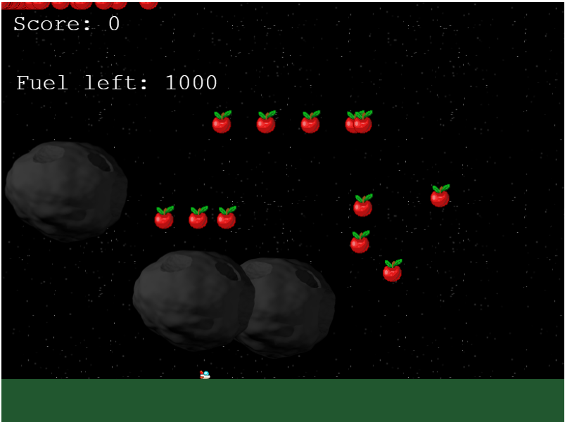

# Fly 

> This is a Microverse Capstone Project

> Fly!

## Description

Fly is a microverse capstone project which shows that the student has mastered using JavaScript. Fly is a JavaScript game i built using Phaser 3 frmawork. It is a role playing game, the player navigates to collect as much as apples before he or she runs out of gas.

The player uses keyboard up, down, left and right keys to navigate and collect the apples. The game ends when a player runs out of gas. Phaser 3 presents opportunity to implement great games and also master ES6 JavaScript syntax.

Play while try not to run out of gas.

## Live link

Here is a live <a href="https://fly-game.herokuapp.com/">link</a> to the game.

## Features

In this project the following features were implemented.

- Username, to save individual's scores.
- Player, inform of a space ship to collect apples.
- Mets to prevent player from accessing apples easily.
- System that check gas. When player moves gas reduces and ganme ends when player runs out of gas

## Built with

- HTML
- Git
- CSS
- JavaScript
- Shields.io
- Webpack
- Nodejs
- Phaser3

## Deployment

1. Clone the repo
2. run `npm run i` and `npm run start:dev`
3. Open `http://localhost:8080/`
4. Enjoy :)

## Testing

1. Run `npm i`
2. Run `npm test`

## Author

Reach out to me!

👤 **Hillary Kiptoo**

- LinkedIn: [Hillary Kiptoo](https://www.linkedin.com/in/hillarykiptoo)
- Github: [@imhilla](https://github.com/imhilla)
- Twitter: [@hillarykiptoo](https://twitter.com/hillarykiptoo_)

## Contributing 🤝

Contributions, issues, and feature requests are welcome!

Feel free to check the [issues page](https://github.com/imhilla/Fly/issues).

## Acknowledgments

- Thanks to Microverse for its support!
- Thanks Phaser3

## Show your support

Give a ⭐️ if you like this project!

## License

- **[MIT license](http://opensource.org/licenses/mit-license.php)**
